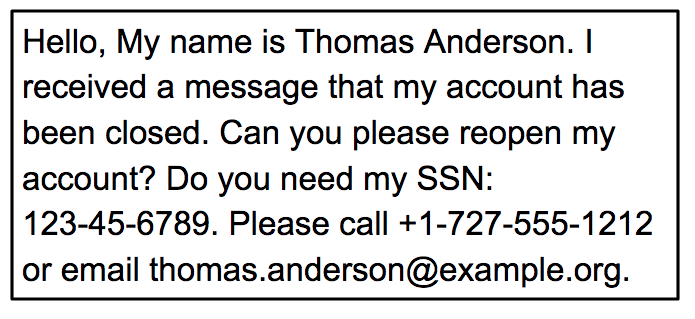
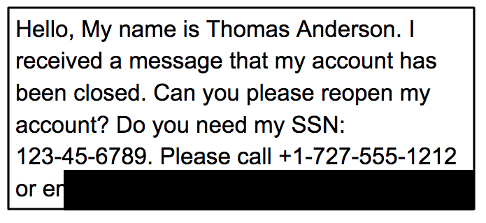

## Redact Assets w/ Data Loss Prevention API 


- Enable the DLP API from GCP 
- Install the DLP API

```sh
git clone https://github.com/googleapis/nodejs-dlp.git
```

- Install Nodejs and samples 
```sh
cd nodejs-dlp/samples
npm install @google-cloud/dlp
npm install yargs
npm install mime
```


### Inspect Sensitive information
Using `ìnspectString.js` explicit your data.

- E.g. your email adress in assets
```sh
node inspectString.js $GCLOUD_PROJECT "My email address is joe@example.com."
```
- E.g. your phone number(s) in assets
```sh
node inspectString.js $GCLOUD_PROJECT "My phone number is 555-555-5555."
``

`

### Redact sensitive data from images

- Give output to the system e.g.





- from `nodejs-dlp/samples` redact the email address values from the image

```sh
node redactImage.js $GCLOUD_PROJECT ~/dlp-input.png "" EMAIL_ADDRESS ~/dlp-redacted.png
```

We specified EMAIL_ADDRESS as the infotype to redact. 

In the image, you should notice that the email address is no longer visible.




 